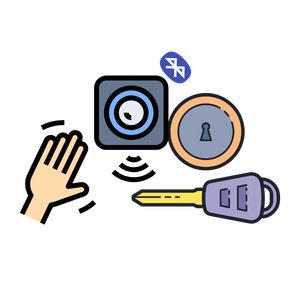
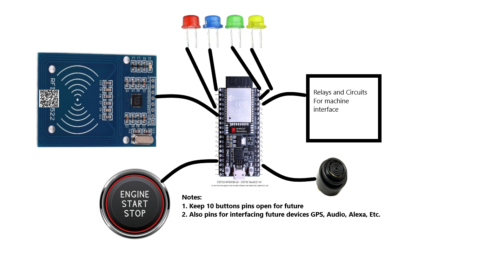
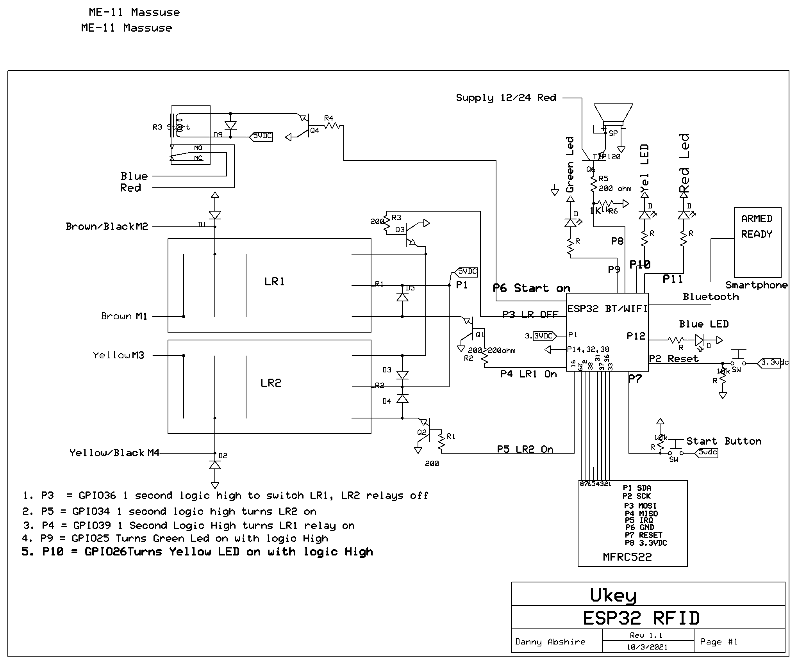
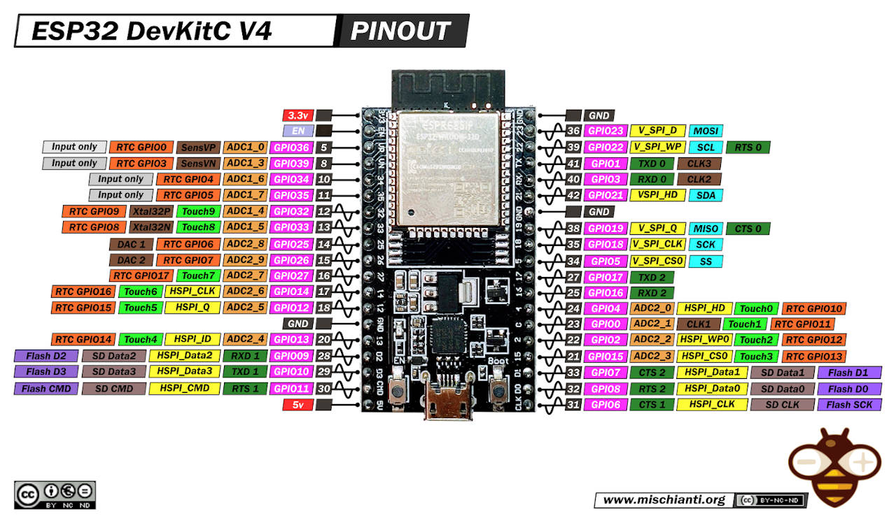

<p align="center">
  <a href="" rel="noopener">
 </a>
</p>

<h3 align="center">Smart Ignition System</h3>

<div align="center">

[]()


</div>

---


<p align="center"> Smart Ignition System
    <br> 
</p>

## 📝 Table of Contents

- [About](#about)
- [Getting Started](#getting_started)
- [Circuit](#circuit)
- [Usage](#usage)
- [List Of Components](#list)
- [Built Using](#built_using)
- [Authors](#authors)


## 🧐 About <a name = "about"></a>

This repo contains

- Firmware
- Circuit
- Detailed instructions

for Sound Smart Ignition .


## Getting Started <a name = "getting_started"></a>

These instructions will get you a copy of the project up and running on your system. 

### Prerequisites

Things you need to install the FW.

```
- VSCode with latest Platform.io installed
```

### Installing <a name = "installing"></a>

A step by step series that tell you how to get the Firmware and Backend running

#### ESP32 Configuration

You should have latest Platform.io installed in your VSCode

  1. Open the project present in Firmware folder from you Platform.io homepage.
  2. Upload the code.
  3.  That’s it. It should be working after a few seconds.


## Circuit <a name = "circuit"></a>

*   High Level Connections


*   Circuit Schematics


### ESP32 Dev Kit v4 Pinout




## Usage <a name = "usage"></a>

1.  Upload the code to your ESP32 Dev KitC V4 using Platform.io.
2.  Open the serial monitor.
3.  Scan a RFID Card and note down its NUID being displayed on the Serial Monitor.
4.  Then open main.cpp from Firmware/SmartIgnition/src folder.
5.  Edit line number 22 which states *"addAllowedNUID("3219320124");"* so that the number in addAllowedNUID function parameter should be the one you noted down from the serial monitor.
6.  You can add as many NUIDs as you wish by just copying the line number 22 below itself multiple times with different NUIDs. The system willl only work with the allowed NUIDs added using this method.

## List of Components <a name = "list"></a>

Following components are used to make this project

1.  ESP32 DevKitC V4
2.  MFRC522 RFID Reader
3.  Generic Push buttons
4.  Generic LEDs
5.  Generic Peizo Buzzer.


## ⛏️ Built Using <a name = "built_using"></a>

- [Platform.io](https://platformio.org/) - Embedded IDE 


## ✍️ Authors <a name = "authors"></a>

- [@Nauman3S](https://github.com/Nauman3S) - Development and Deployment
